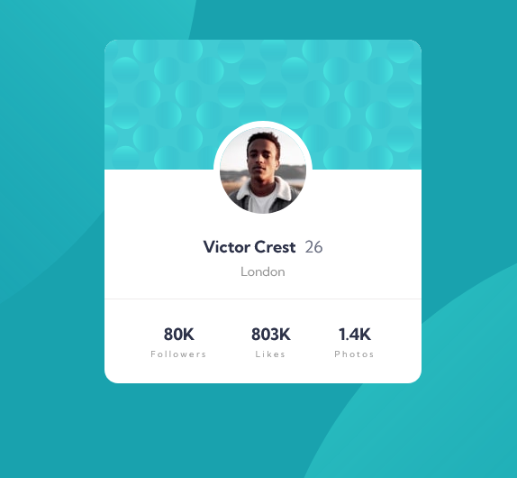

# Frontend Mentor - Profile card component solution

This is a solution to the [Profile card component challenge on Frontend Mentor](https://www.frontendmentor.io/challenges/profile-card-component-cfArpWshJ).

## Table of contents

- [Overview](#overview)
  - [The challenge](#the-challenge)
  - [Screenshot](#screenshot)
  - [Links](#links)
- [My process](#my-process)
  - [Built with](#built-with)
  - [What I learned](#what-i-learned)
  - [Continued development](#continued-development)
- [Author](#author)

## Overview

### The challenge

- Build out the project to the designs provided

### Screenshot

<center>


<br/>
Desktop design

</center>

### Links

- Solution URL: [Here!](https://github.com/mizek1/profile-card-component)
- Live Site URL: [Here!](https://mizek1.github.io/profile-card-component/)

## My process

### Built with

- Semantic HTML5 markup
- CSS custom properties
- Flexbox
- Grid
- BEM methodology
- Mobile first

### What I learned

This one was pretty easy! I tried to add some things like BEM methodology, which is nice to keep the css clean and organized.

Some snippets:

> The BEM methodology in HTML:

```html
<div class="card">
  <div class="card__header"></div>
  
  <div class="card__main-info">
    <div class="card__name">Victor Crest</div>
    <div class="card__age">26</div>
  </div>
  <div class="card__city">London</div>
  <div class="card__footer">
    <div class="card__stats">
      <div class="card__stat">
        <div class="card__number">80K</div>
        <div class="card__heading-stat">Followers</div>
      </div>
      <div class="card__stat">
        <div class="card__number">803K</div>
        <div class="card__heading-stat">Likes</div>
      </div>
      <div class="card__stat">
        <div class="card__number">1.4K</div>
        <div class="card__heading-stat">Photos</div>
      </div>
    </div>
  </div>
</div>
```

> The BEM methodology in CSS:

```css
.card__header {
  background-image: url(/images/bg-pattern-card.svg);
  background-position: center;
  background-size: cover;
  border-radius: 15px 15px 0 0;
  height: 8em;
  width: 100%;
}

.card__picture {
  border: 7px solid var(--white);
  border-radius: 50%;
  margin-top: -3em;
}

.card__main-info {
  display: flex;
  margin-top: 1em;
}

.card__name {
  color: var(--dark-desaturated-blue);
  font-weight: 700;
  margin-right: 0.5em;
}

.card__age {
  color: var(--dark-grayish-blue);
}

.card__city {
  font-size: 14px;
  color: var(--dark-gray);
  margin: 0.5em 0 1.5em 0;
}
```

### Continued development

I still need to learn more about BEM methodology and how to make my code more clean and reusable!

## Author

- Website - [Danilo Alves](https://github.com/mizek1)
- Frontend Mentor - [@mizek1](https://www.frontendmentor.io/profile/mizek1)
